# Credit Card Fraud Detection

1000\$ has been deducted from your AC xxxx1234. This message is enough to send most into people panic mode! if the transaction is not made by them. In this project, I used data mining approach to solve the problem of hoax transaction by detecting whether it is fraudulent and to forbid it.

### <ins>Table of contents</ins>:

- [ Introduction ](#intro)
- [ Data Description & EDA ](#desc)
- [ Sampling ](#sample)
- [ Metrics & Validation ](#val)
- [ Modeling & Results ](#res)
- [ Conclusion ](#con)

### Introduction:

A staggering \$24.26 Billion was lost in 2018 due to payment card fraud worldwide and United States still leads the world as the most card fraud prone country with 38.6 % of reported card fraud losses in 2018. This is a huge problem because it costs consumers and financial company billions of dollars annually, and fraudsters continuously try to find new rules and tactics to commit illegal actions. What makes it even more interesting is that one may not be even aware of fraud even if they are victimized. Plenty of steps have taken to address the issue but with less efficacy because of the lack of predictive model’s tendency to perform well with an unseen pattern. It is still a major issue in datamining techniques, but it performs better than the former but is less widely used.

|  |
| :----------------------------: |

This essentially needs to be reduced with constant innovations and in this project, I evaluated in detail random forests, support vector machines, logistic regression, light gradient boosting and extreme gradient boosting algorithms as an attempt to detect the fraudulent transactions better. Though the data mining techniques are in profuse use in many fields, little have been their usage in card detection. But, many papers in early 1990’s have used neural networks and to some extent Markov models. Their study was focused on impact of aggregating transaction level data of fraudulent prediction. The reason neural networks are not tried is because they are prone to get overfit and may get struck in a local minima or saddle point. Also, the data mining models gives flexible optimization approach. Ensemble methods were preferred because they have very good generalization performance. Many statistical methods like logistic regression, nearest neighbor, Bayes classifier have been used to develop models and with evolution of AI and machine learning, the other advanced techniques were also used and compared with the earlier mentioned models.

### Data Description:

##### Note: Sorry for the sub par quality of plots as they were snipped from report because the code file was lost.

The dataset is obtained from Vesta corporation via Kaggle competition. The training dataset is of the shape 590540\*434 after merging the train identity and train transaction datasets. The two datasets have Transaction Id’s as common. The Train transaction has many important features like Time delta which is the transaction timeline from a given reference. The data feature isFraud is the response variable which is a binary feature. It also has Product codes which haven’t been revealed.

| 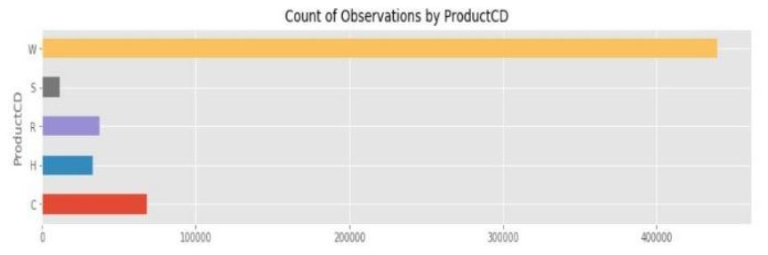 |
| :------------------------------------: |

The Transaction amount is given in USD and it has a fair distribution only after transforming it which can be seen in the plot below.

| 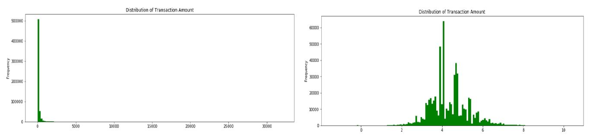 |
| :------------------------------------------------------------: |

I have created new features hour, day and month when the transaction is been done. These details are extracted from Time delta which is in the seconds format and spans over four months in time. This is also been offset to get correct day of the week. These new features were very important in determining which time of day of week were the fraudulent transactions at peak, etc.
There are also other important features like, card1, card2, card3, card4, card5 and card6 which has details of card type, card category, issued bank, country, etc which were very useful. Also,addresses of the receiver and purchaser were given including their email domain which can be visualized in the below plot.

| 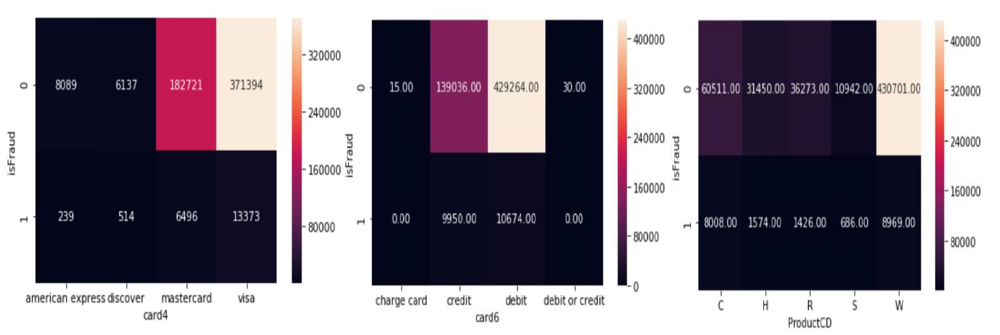 |
| :-------------------------------: |

There are also other features which are mentioned as vesta engineered features, and the actual meaning of it were masked. The train Identity also has Transaction Identity which is to be merged with train transaction. It has categorical features like id which has only True, False or nan values and their meanings are also masked. They contain the type of device like mobile, desktop, etc from which the transactions were performed and Device Info such as Samsung, RedMI, Ios, windows, etc. The below plots visualizes the top devices from which transactions are done, the device type counts and most importantly the percentage of fraud which were done on device type which has quite interesting result.

| 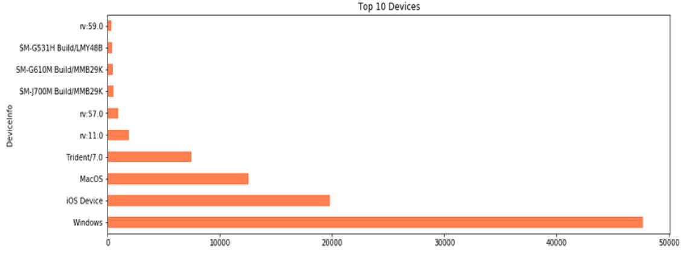 |
| :-----------------------------------------: |

| 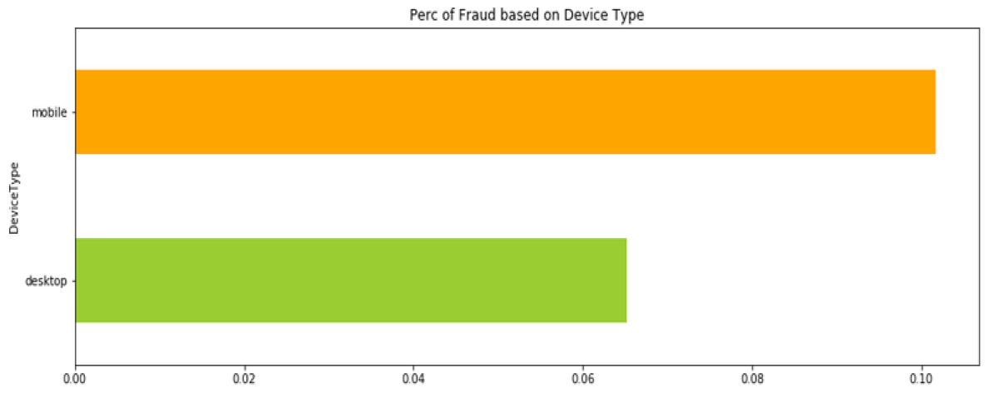 |
| :---------------------------------------------: |

The testing set is of shape 506691\*433 and it doesn’t have the ground truth labels which made it impossible to find test roc.
There were a lot of missing values, 232 columns had missing values more than 30 percent and few columns had more than 90 percent missing values, which were dropped because, they add no importance because of the lack of information it could provide. There are about 90 columns with missing values in between 10 and 30 percentage, with majority of them being Vesta engineered rich features.Values were imputed to the columns that has less than 10 percent missing values and the rows of columns were dropped that seemed to offer no importance. For the Categorical values with less than ten percent values, imputation with mode is considered.

Because the datasets were taking up huge memory, memory reduction technique was employed which affected the accuracy by an inconsiderable amount (very less).Also, because of large number of features feature reduction techniques like Principle component Analysis and Linear Discriminant Analysis were employed. The steps involved in LDA are computing the d dimensional mean vectors for the two classes from the dataset followed by computing scatter matrices and corresponding eigen vectors. Then, the eigenvectors are sorted by decreasing eigenvalues and choose k eigenvectors with the largest eigenvalues to form a d×k dimensional matrix and then to matrix to transform the samples onto the new subspace.

| 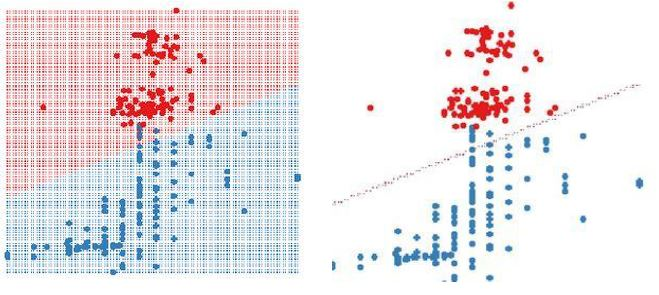 |
| :--------------------------------------------: |

Both LDA and PCA were performed and PCA was chosen, because it explained the total variance in the data better than LDA and I worked with only 100 features for modelling which yielded impressive results.

### Sampling:

One of the major problems that had to be tackled was dealing with the class imbalance. Almost 96 percent of the values in the training set were found to be not associated with any type of fraud activity. There were only 4 percent of the data to be identified as fraudulent. This when not dealt with correctly will lead to prediction results which will be high, but they will be misleading because the number of False positives might be very dangerous in card fraud detection. So, the follwing methods were followed to tackle the problem.

    - [ Under Sampling ](#us)
    - [ Over Sampling ](#os)

| 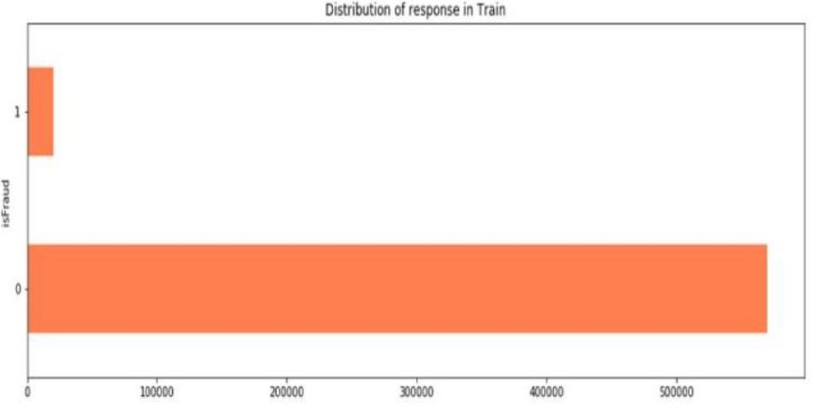 |
| :-----------------------------------------: |

#### Under-Sampling

Under sampling is a method in which the majority class is reduced to match the specified number or the minority class. Then the results of it are evaluated by fitting a logistic regression classifier to check the area under the ROC curve.

| 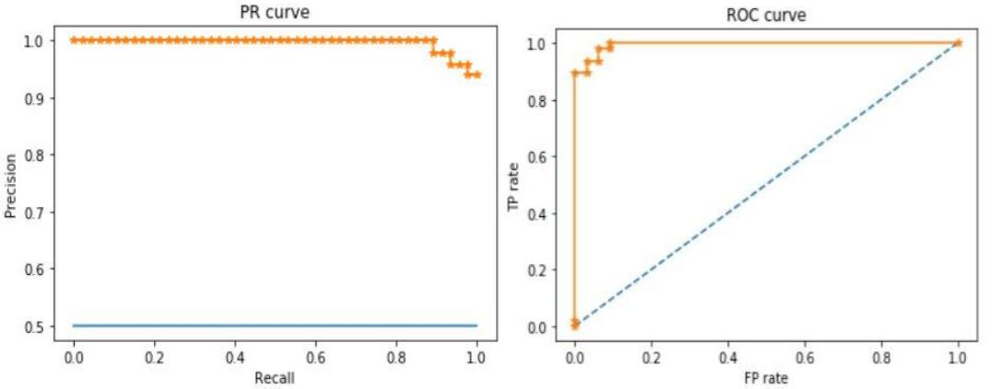 |
| :-----------------------------------------: |

#### Over-Sampling

Over sampling is a method in which the minority class is increased to match the specified number or the majority class. Then the results of it are evaluated by fitting a logistic regression classifier to check the area under the ROC curve.

| 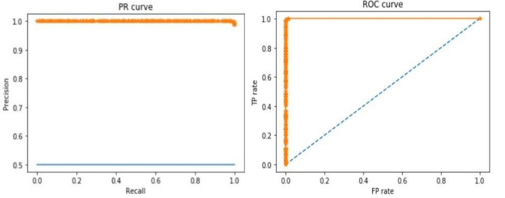 |
| :-----------------------------------------: |

### Metrics and Validation:

Area under the receiver operating characteristic curve (AUROC), and F1 score were used to evaluate the model. For validation of models, Adversarial validation and Cross validation were implemented.

| 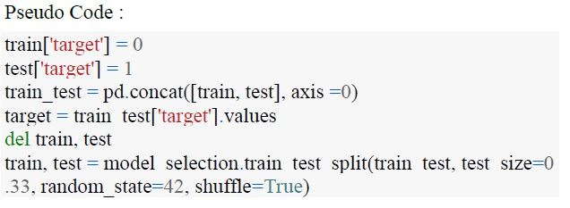 |
| :--------------------------------------------------: |
|      **Pseudocode for Adversarial Validation**       |

### Modeling and Results:

The hyperparameters that were tuned for **Random Forest** model are Number of Trees set at 100, 200 and 300 and the minimum number of samples at the leaf node 10, 30, 50. And max Depth at 8, 12.
**Logistic Regression** Model has only dummy significance parameter tuning. The hyperparameters that were tuned for **Support Vector Machine** model varies from kernel to kernel. They include, gamma tuning and regularization parameter. Here, various kernels like linear, sigmoid waas considered
The hyperparameters that were tuned for **Gradient Boosting** model are number of trees (1000, 1500), interaction depth (1,3), learning rate (0.001, 0.005, 0.008), maxdepth(9,12). The prediction probability is valued at 1 for >0.5 and 0 for <0.5.

 

#### Variable Importance

|           Model           |               Variable Importance plot               |
| :-----------------------: | :--------------------------------------------------: |
|      Random Forests       | 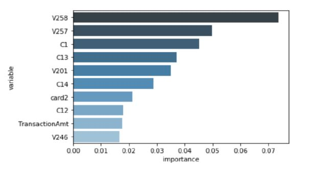 |
|    Logistic regression    | 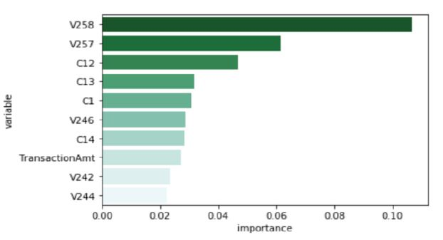 |
|  Support Vector Machine   | 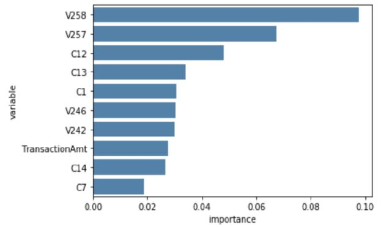 |
|  Light Gradient Boosting  | 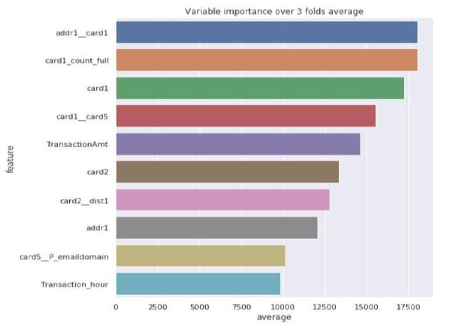 |
| Extreme Gradient Boosting | 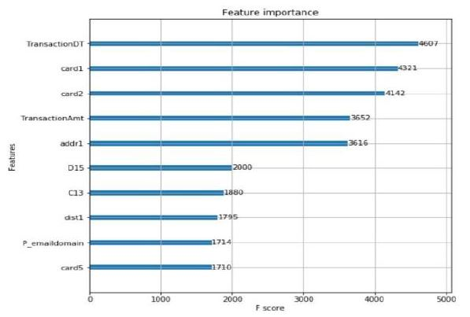 |

 

#### Confusion Matrix

|           Model           |               Variable Importance plot               |
| :-----------------------: | :--------------------------------------------------: |
|      Random Forests       | 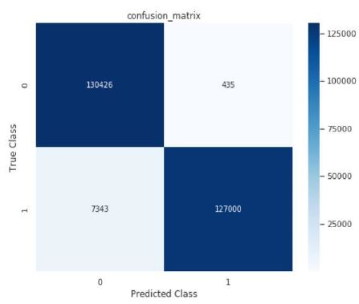 |
|    Logistic regression    | 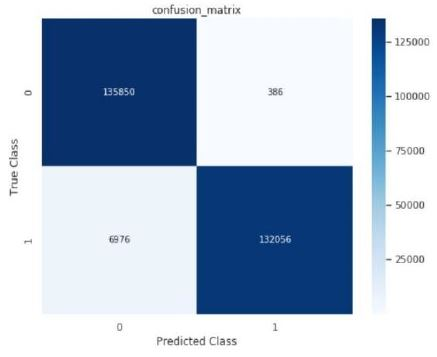 |
|  Support Vector Machine   | 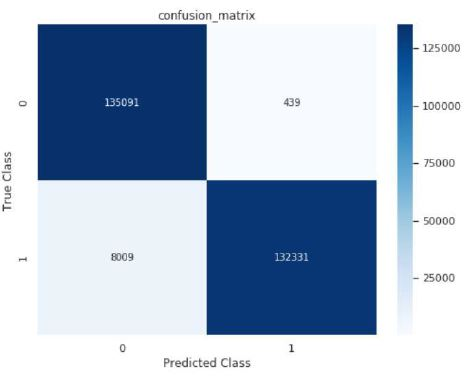 |
|  Light Gradient Boosting  |  |
| Extreme Gradient Boosting | 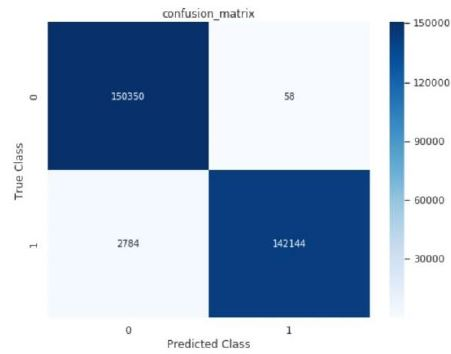 |

### Conclusion:

|           Model           | F1 score | Precision | Specificity | FP rate | Sensitivity |
| :-----------------------: | :------: | :-------: | :---------: | :-----: | :---------: |
|      Random Forests       |  0.9710  |  0.9967   |   0.9966    | 0.0034  |   0.9467    |
|    Logistic regression    |  0.9737  |  0.9972   |   0.9971    | 0.0029  |   0.9512    |
|  Support Vector Machine   |  0.9697  |  0.9968   |   0.9967    | 0.0033  |   0.9440    |
|  Light Gradient Boosting  |  0.9919  |  0.9996   |   0.9996    | 0.0004  |   0.9843    |
| Extreme Gradient Boosting |  0.9906  |  0.9996   |   0.9996    | 0.0004  |   0.9818    |

It can be clearly seen that the Ensemble models outperforms all the other models. Particularly, boosting was so effective on predicting whether the card transaction is fraudulent or not. The best model  obtained was Light Gradient Boosting  which has a roc almost equal to 1. Although the other metrics like precision, sensitivity, specificity are similar amongst the models, the key parameter in determining the difference was roc. And light gradient boosting has the lowest False Positive rate. This was possible only because of correcting the class imbalance which made the model more robust to new pattern. 

Boosting methods produced good quality results that revolved around distinct concepts. Logistic regression underperformed as it was not able to differentiate the two classes better. Usage of adversarial validation helped in making better predictions and obtained low False positive rate. Also, from the variable importance plot it can be seen that Transaction amount and time were one of the most important variables. Higher the transaction amount in peak time, higher the probability of fraudulent transaction. Also, few models detected vesta engineered features to be important, but weren't able to identify them because the real description was masked for privacy purposes. Also, the type of card that had most fraud transactions was visa card which is because they are more in number than the rest of the cards and another interesting fact is that the transactions done through mobile have most fraud transaction probability. It was also noted that IOS did have a less probability of fraud detection

